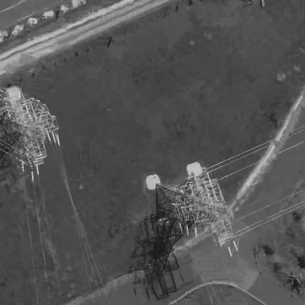
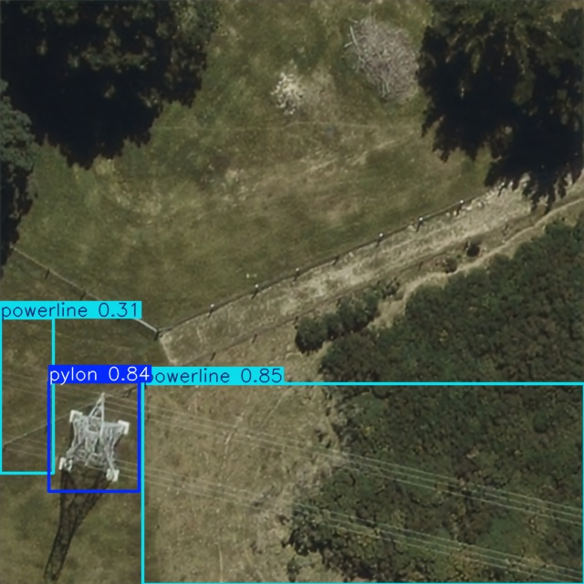
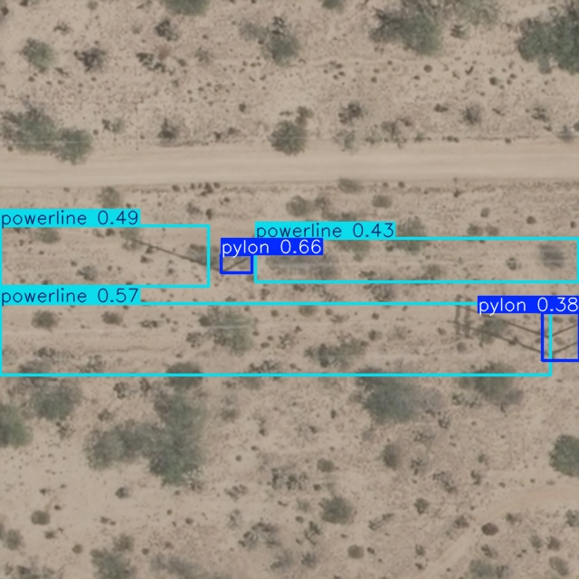
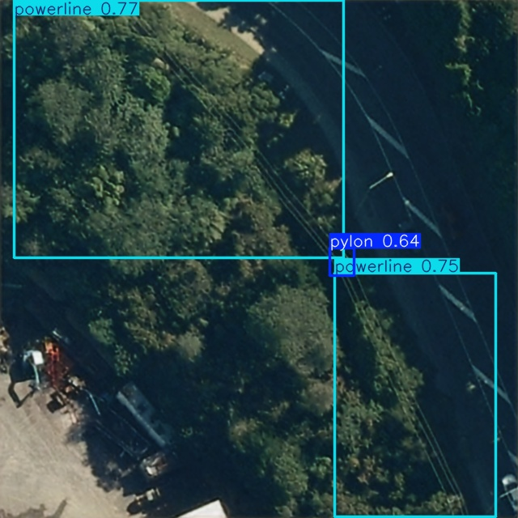
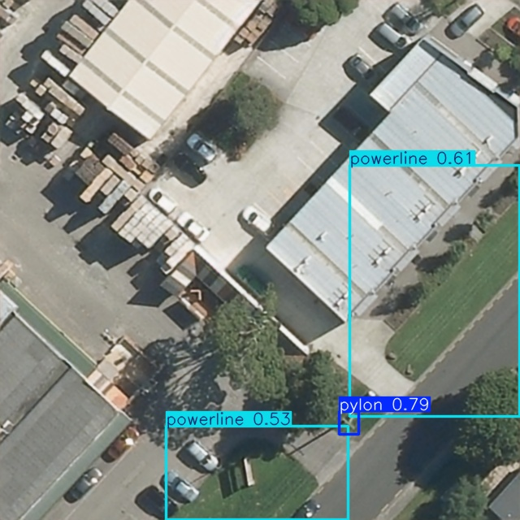

# sar-powerline-detection
SAR-based Powerline Damage Detection System, integrating multimodal fusion technology for automatic powerline detection and damage assessment.

## Project Introduction
A SAR-based powerline damage detection system utilizing multimodal fusion technology for automatic powerline detection and damage assessment. The project focuses on powerline detection, with damage assessment under development.

The system integrates optical and SAR (Synthetic Aperture Radar) images through advanced fusion techniques to improve detection accuracy, especially in adverse weather conditions where optical images may be obstructed by clouds.

## Project Structure
```
sar-powerline-detection/
├── convert_to_sar/          # Optical to SAR image conversion tool
├── Dataset/                 # Dataset containing images and annotations
│   ├── images/              # Image data
│   │   ├── fused/           # Fused images (optical + SAR)
│   │   ├── optical/         # Optical images
│   │   ├── sar/             # SAR images
│   │   └── sar_bm3d/        # Denoised SAR images
│   └── labels/              # YOLO format annotations
├── models/                  # Trained model weights
│   ├── fusion_model_best.pt # Multimodal fusion model
│   └── yolo_detect_best.pt  # YOLO detection model
├── SARBM3D_v10_win64/       # SAR image denoising tool
└── multimodal_fusion/       # Multimodal fusion network
```

## Project Flow
1. **Data Processing**: 
   - Obtain optical images and tower annotations from LSKF-YOLO
   - Add powerline annotations and modify existing tower annotations
   - Convert optical images to grayscale with speckle noise to simulate SAR images (saved in sar/ folder)
   - Denoise simulated SAR images using SAR-BM3D (saved in sar_bm3d/ folder)

2. **Multimodal Fusion**: 
   - Extract high-dimensional features from optical images (from optical/ folder) and denoised SAR images (from sar_bm3d/ folder)
   - Fuse features through attention mechanisms
   - Generate fused pseudo-optical images (saved in fused/ folder)

3. **Object Detection**: 
   - Train YOLO model on fused images for powerline and tower detection
   - Evaluate detection performance

4. **Damage Assessment** (In development): 
   - Evaluate powerline damage based on detection results

## Technical Features
- **Multimodal Fusion**: Combines optical texture and SAR structural information for enhanced detection
- **Attention Mechanism**: Automatically learns modality importance weights
- **Edge Preservation**: Retains powerline edge information for improved detection accuracy
- **Cloud Penetration**: Leverages SAR's cloud-free characteristics for adverse weather detection
- **Hybrid Precision Training**: Improves training speed and memory efficiency

## Installation & Environment Setup

### Prerequisites
- Python 3.9+
- PyTorch 1.10+
- MATLAB (for SAR-BM3D denoising)
- Microsoft Visual C++ 2010 Redistributable Package (for SAR-BM3D)

### Dependencies
```bash
# For convert_to_sar
pip install Pillow

# For multimodal_fusion
pip install torch torchvision opencv-python numpy pillow

# For YOLO detection (will be added)
pip install ultralytics
```

## Usage Guide

### 1. Convert Optical Images to SAR
```bash
cd convert_to_sar
# Place optical images in images/ folder
python convert_to_sar_simple.py
# SAR images will be saved in output/ folder
```

### 2. Denoise SAR Images
```matlab
% Open MATLAB and navigate to SARBM3D_v10_win64 directory
% Run the denoising script
run('run.m')
```

#### Denoising Results Comparison
The following images demonstrate the effectiveness of SAR-BM3D denoising:

| Before Denoising (SAR) | After Denoising (BM3D) |
|:---:|:---:|
|  |  |
| *Simulated SAR image with speckle noise* | *Denoised SAR image using BM3D* |

As shown above, SAR-BM3D effectively removes speckle noise while preserving important structural information and edge details of powerlines and towers.

### 3. Multimodal Fusion
```bash
cd multimodal_fusion
# Place optical images in data/optical/ folder
# Place denoised SAR images in data/sar/ folder
python multimodal_fusion.py
# Fused images will be saved in data/fused/ folder
```

### 4. Object Detection
```bash
# Using the trained YOLO model for detection
cd yolo-detector
# Ensure the following directory structure exists in yolo-detector directory
# data/
# ├── val/
# │   └── images/  # Place fused images to detect
# └── output/       # Detection results will be saved here

python inference.py
# Detection results will be saved in data/output/ directory
```

#### Detection Process
1. The script automatically finds the latest trained model in `runs/detect/` directory
2. It processes all images in `data/val/images/` directory
3. Applies NMS (Non-Maximum Suppression) to filter overlapping detection boxes
4. Saves annotated results in `data/output/` directory with bounding boxes for detected power towers and lines

#### Detection Results
The detection results include:
- Bounding boxes for power towers (labeled as 'pylon')
- Bounding boxes for powerlines (labeled as 'powerline')
- Confidence scores for each detection
- Annotated images saved in the output directory

#### Detection Results Examples
The following images show detection results on fused images, demonstrating the system's ability to accurately identify power towers and powerlines:

| Example 1 | Example 2 |
|:---:|:---:|
|  |  |
| *Power tower and line detection in rural area* | *Multiple tower detection in complex terrain* |

| Example 3 | Example 4 |
|:---:|:---:|
|  |  |
| *Long-distance powerline detection* | *Dense powerline network detection* |

The detection results demonstrate high accuracy in identifying both power towers (shown with bounding boxes) and powerlines, even in challenging scenarios with complex backgrounds and varying lighting conditions.

## Dataset
The project builds upon the SRSPTD dataset from [LSKF-YOLO](https://github.com/ZX815/LSKF-YOLO), which provides the base optical images and tower annotations. The dataset has been significantly extended and modified for this project:

- **Base components from LSKF-YOLO**:
  - Optical images of power towers and lines
  - Initial YOLO format annotations for towers

- **Enhancements and modifications by this project**:
  - **Simulated SAR images**: Generated from optical images using speckle noise simulation
  - **Denoised SAR images**: Processed using SAR-BM3D for improved quality
  - **Fused images (optical + SAR)**: Created through multimodal fusion network
  - **Modified annotations**: Updated tower annotations and added powerline annotations

## Model Weights
The `models/` directory contains pre-trained model weights:

- `fusion_model_best.pt`: Multimodal fusion model for combining optical and SAR features
- `yolo_detect_best.pt`: YOLO detection model for powerline and tower detection

**Note**: Model weights are large files and should be managed with Git LFS when uploading to GitHub.

## Citation
This project uses the SRSPTD dataset from LSKF-YOLO, which requires citing the following paper:

C. Shi, X. Zheng, Z. Zhao, K. Zhang, Z. Su and Q. Lu, "LSKF-YOLO: Large Selective Kernel Feature Fusion Network for Power Tower Detection in High-Resolution Satellite Remote Sensing Images," in IEEE Transactions on Geoscience and Remote Sensing, vol. 62, pp. 1-16, 2024, Art no. 5620116, doi: 10.1109/TGRS.2024.3389056.

## License
This project is for research and educational purposes only. Please refer to the individual licenses of the components used:

- SAR-BM3D: Refer to LICENSE.txt in the SARBM3D_v10_win64 directory
- Multimodal fusion and detection components: MIT License

## Acknowledgements
- [LSKF-YOLO](https://github.com/ZX815/LSKF-YOLO) for providing the SRSPTD dataset
- [SAR-BM3D](http://www.grip.unina.it/) for SAR image denoising
- PyTorch and YOLO communities for their excellent frameworks